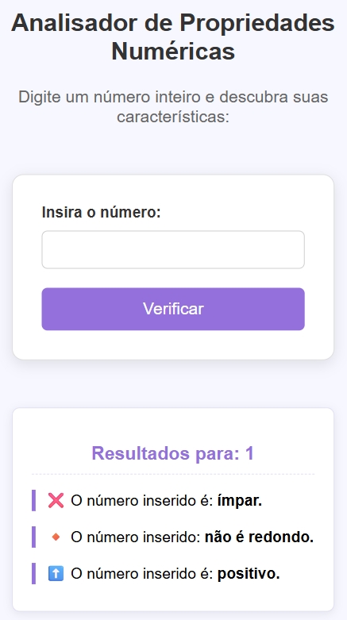

# ✨ Verificador Numérico (PHP)

<p align="center">
  
  
  
</p>

## 💡 Descrição do Projeto

Este projeto é uma aplicação web simples e funcional, desenvolvida para demonstrar proficiência no **processamento de formulários** e **lógica condicional** em **PHP**.

A ferramenta recebe um número inteiro fornecido pelo usuário via formulário HTML e realiza uma série de verificações lógicas e matemáticas, apresentando os resultados de forma clara.

---

## 🚀 Competências e Funcionalidades

Este trabalho destaca as seguintes habilidades e recursos implementados:

* **Processamento de Formulários (`POST`):** Recebimento e tratamento seguro de dados de entrada do usuário.
* **Lógica Condicional:** Uso eficiente de comandos `if/elseif/else` para tomada de decisões.
* **Operadores Matemáticos:** Aplicação do operador de **Módulo** (`%`) para análises de divisibilidade.
* **Organização de Código:** Separação das responsabilidades de *frontend* e *backend* (HTML, CSS e PHP).

### Detalhes das Verificações

| Propriedade | Objetivo | Condição PHP |
| :--- | :--- | :--- |
| **Par ou Ímpar** | Determinar se o número é divisível por 2. | `$num % 2 == 0` |
| **Redondo** | Verificar se o número é múltiplo de 10 (terminado em zero). | `$num % 10 == 0` |
| **Sinal** | Classificar o número como Positivo, Negativo ou Neutro (zero). | `$num > 0`, `$num < 0` |

---

## 🛠️ Tecnologias Utilizadas

* **PHP:** Lógica de *backend* e processamento de dados.
* **HTML5:** Estrutura semântica e formulário de entrada (`<input type="number">`).
* **CSS:** Estilização da interface para uma experiência de usuário limpa e agradável.

---

## ⚙️ Como Executar

Para rodar o projeto localmente, é necessário ter um ambiente de servidor web com suporte a PHP (como XAMPP, WAMP ou MAMP).

1.  **Clone o Repositório:**
    ```bash
    git clone [LINK_DO_SEU_REPOSITÓRIO]
    ```
2.  **Organize os Arquivos:** Coloque os arquivos (idealmente `index.php` e `style.css`) na pasta raiz do seu servidor (`htdocs` ou `www`).
3.  **Acesso:** Abra seu navegador e acesse o endereço do arquivo: `http://localhost/[NOME_DA_PASTA]/index.php`

---

## 🔗 Referências

* **Estilização:** DevMedia
* **Estrutura de README:** Alura


